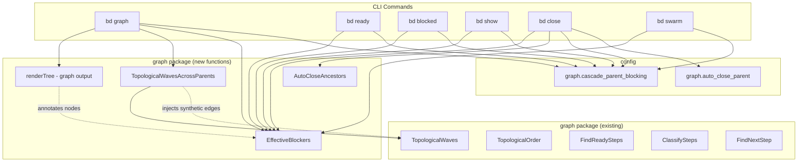
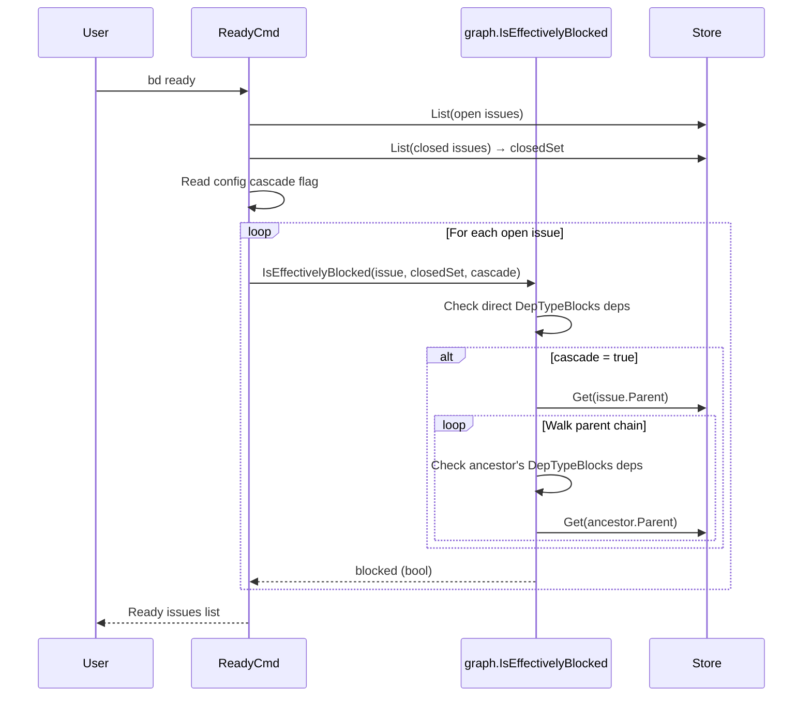
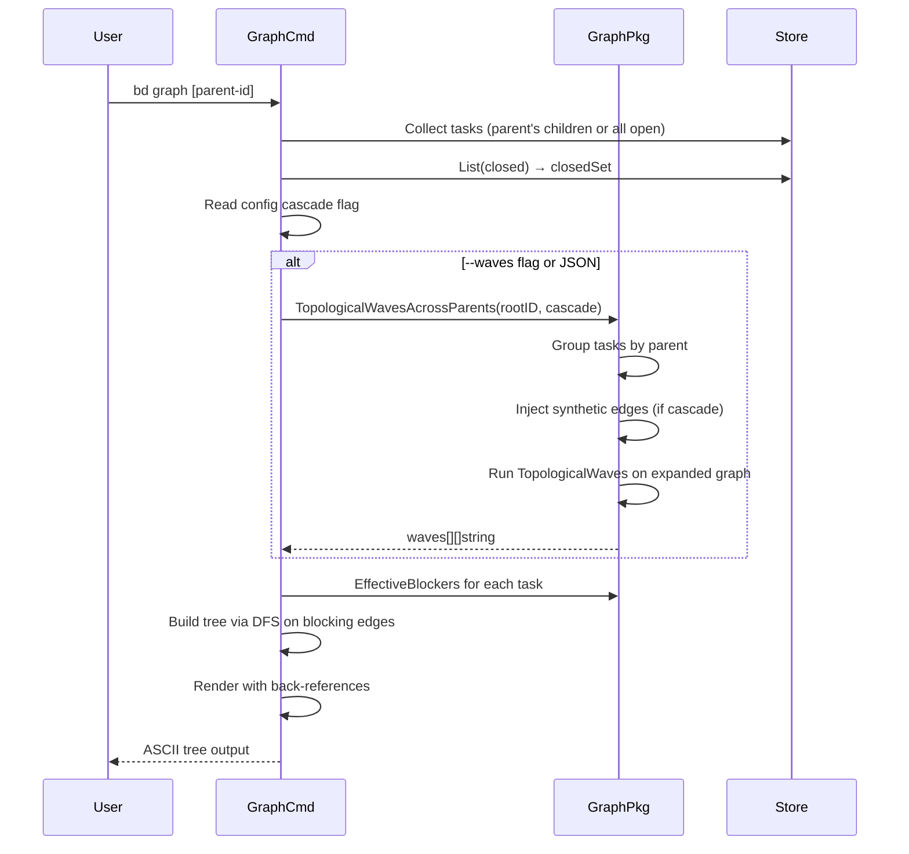

# Graph Command & Cascading Parent Blockers — Design Doc

## Summary

Three related features:

1. **`bd graph`** — A new command that renders the dependency graph as an ASCII tree with back-references for DAG edges
2. **Cascading parent blockers** — When parent B blocks parent A, all tasks in A are blocked until all tasks in B close. This affects `bd graph`, `bd ready`, `bd blocked`, `bd show`, `bd close`, and `bd swarm`.
3. **Auto-close parent** — When all children of a parent issue are closed, the parent is automatically closed too, recursing up the hierarchy.

Features 1 and 2 share a core primitive: `EffectiveBlockers()` in the graph package, which walks the parent chain to find inherited blocking constraints. Feature 3 hooks into `bd close` via `AutoCloseAncestors()`. Two config flags gate the new behaviors: `graph.cascade_parent_blocking` (default `true`) for cascading blockers, and `graph.auto_close_parent` (default `true`) for auto-closing.

### Note on Terminology

Throughout this doc, "parent" means any issue that has children via parent-child dependencies — regardless of issue type. Epics, tasks, bugs, features, chores, and any other issue type can all be parents. The cascading and auto-close behaviors follow the `Parent` field, not the `Type` field.

## Architecture

### Component Diagram



### Import Flow

Follows the existing layered pattern from ARCHITECTURE.md:

```
cmd/ → graph/ → issuestorage/
 ↓
config/
```

The graph package does NOT import config. Config flags are read at the cmd layer and passed as `bool` parameters (`cascade`, `autoClose`) to graph functions, keeping them pure and testable.

## Core Primitive: `EffectiveBlockers`

### Data Types

```go
// InheritedBlocker represents a blocking constraint inherited from an ancestor.
type InheritedBlocker struct {
    AncestorID string // the parent/grandparent that has the blocking dep
    BlockerID  string // the issue blocking that ancestor
}

// EffectiveBlockersResult holds both direct and inherited blocking info.
type EffectiveBlockersResult struct {
    Direct    []string           // direct DepTypeBlocks dependency IDs that are unclosed
    Inherited []InheritedBlocker // blocking constraints from ancestors
}
```

### Function Signature

```go
// EffectiveBlockers returns all blocking constraints on an issue:
// - Direct: the issue's own unclosed DepTypeBlocks dependencies
// - Inherited: unclosed DepTypeBlocks dependencies from any ancestor in the parent chain
//
// When cascade_parent_blocking is false, Inherited is always empty.
func EffectiveBlockers(
    ctx context.Context,
    store issuestorage.IssueGetter,
    issue *issuestorage.Issue,
    closedSet map[string]bool,
    cascade bool,
) (*EffectiveBlockersResult, error)
```

### Algorithm

```
EffectiveBlockers(issue, closedSet, cascade):
    direct = []
    for dep in issue.Dependencies where dep.Type == blocks:
        if dep.ID not in closedSet:
            direct.append(dep.ID)

    inherited = []
    if not cascade:
        return {direct, inherited}

    currentID = issue.Parent
    visited = {issue.ID}
    while currentID != "":
        if currentID in visited:
            break  // cycle guard
        visited.add(currentID)

        ancestor = store.Get(currentID)
        for dep in ancestor.Dependencies where dep.Type == blocks:
            if dep.ID not in closedSet:
                inherited.append({AncestorID: currentID, BlockerID: dep.ID})

        currentID = ancestor.Parent

    return {direct, inherited}
```

### Convenience Helpers

```go
// IsEffectivelyBlocked returns true if the issue has any unclosed direct
// or inherited blocking constraints.
func IsEffectivelyBlocked(
    ctx context.Context,
    store issuestorage.IssueGetter,
    issue *issuestorage.Issue,
    closedSet map[string]bool,
    cascade bool,
) (bool, error)
```

## Auto-Close Parent

### Behavior

When a task is closed and it has a parent, check if all siblings (children of that parent) are now closed. If so, automatically close the parent. Then recurse: check if the parent's parent should also close, and so on up the chain.

This is gated by config flag `graph.auto_close_parent` (default `true`).

### Function Signature

```go
// AutoCloseAncestors walks up the parent chain from the given issue,
// closing each ancestor whose children are all closed. Stops at the
// first ancestor that still has open children, or at the root.
//
// Returns the list of ancestor IDs that were auto-closed (may be empty).
// When autoClose is false, returns nil immediately.
func AutoCloseAncestors(
    ctx context.Context,
    store issuestorage.IssueStore,
    issueID string,
    autoClose bool,
) ([]string, error)
```

### Algorithm

```
AutoCloseAncestors(store, issueID, autoClose):
    if not autoClose:
        return []

    closed = []
    currentID = store.Get(issueID).Parent
    visited = {}

    while currentID != "" and currentID not in visited:
        visited.add(currentID)
        parent = store.Get(currentID)

        if parent.Status == closed:
            // Already closed — don't re-close, but DO continue up
            // the chain. A grandparent may now qualify for auto-close
            // if this closed parent was the last holdout.
            currentID = parent.Parent
            continue

        // Skip gate and molecule types — they have manual lifecycle semantics
        if parent.Type in [gate, molecule]:
            currentID = parent.Parent
            continue

        allChildrenClosed = true
        for childID in parent.Children():
            child = store.Get(childID)
            if child.Status != closed:
                allChildrenClosed = false
                break

        if not allChildrenClosed:
            break  // this ancestor still has open children, stop

        store.Modify(currentID, func(p) {
            p.Status = closed
            p.CloseReason = "Auto-closed: all children completed"
        })
        closed.append(currentID)
        currentID = parent.Parent

    return closed
```

### Integration with `bd close`

After closing the requested issue(s), call `AutoCloseAncestors` for each. Report auto-closed parents in output:

```
Closed bd-t3
Auto-closed bd-e1 (all children closed)
```

For JSON output, add `auto_closed` array to the response.

### Interaction with Cascade Blocking

Auto-closing a parent can have cascading effects: if parent B was blocking parent A, and B just got auto-closed, tasks in A may become unblocked. The `bd close --suggest-next` flow already handles this — `findUnblockedDependents` runs after close, and with `EffectiveBlockers` in place, it will correctly detect that A's tasks are now unblocked (because B is now in the closedSet).

### Edge Cases

- **Ancestor with zero resolved child links** — If an ancestor currently has no children (empty Children() list), skip auto-close for that node and continue traversal upward.
- **Already-closed ancestor** — Skip (don't re-close), but continue walking up. A grandparent may now qualify if this was the last open child.
- **Gate and molecule types** — Excluded from auto-close. These have manual lifecycle semantics (gates are explicitly opened/closed, molecules are managed by swarm). Traversal continues past them.
- **Mixed issue types** — All other types (epic, task, bug, feature, chore) are eligible for auto-close regardless of type.
- **Close reason** — Auto-closed parents get `CloseReason: "Auto-closed: all children completed"` to distinguish from manual closes.

## Cross-Parent Topological Waves

### Function Signature

```go
// TopologicalWavesAcrossParents computes parallelizable waves across multiple
// parent issues, respecting parent-level blocking relationships.
//
// If rootID is non-empty, collects all descendants of that root.
// If rootID is empty, operates on all open non-ephemeral tasks.
//
// When cascade is true, parent-level blocks are translated into synthetic
// task-level edges: if Parent B blocks Parent A, every leaf task in A gets a
// synthetic dependency on every leaf task in B (tasks in B that no other
// B-task depends on).
//
// Returns waves where wave[0] can start immediately, wave[1] after wave[0]
// completes, etc. Also returns a lookup map of ID → Issue for all collected tasks.
func TopologicalWavesAcrossParents(
    ctx context.Context,
    store issuestorage.IssueStore,
    rootID string,
    cascade bool,
) ([][]string, map[string]*issuestorage.Issue, error)
```

### Blocking Frontier

When parent A is blocked by parent B, we need to identify which tasks in B must complete before tasks in A can start. We call this the **blocking frontier** of B — the set of dependency-graph sinks within B's subtree (tasks that no other task within B depends on, i.e. they have no intra-set DepTypeBlocks dependents).

Important: "blocking frontier" is determined by the **dependency graph** (DepTypeBlocks edges), not the parent-child hierarchy. A task with children (a sub-parent) can still be a dependency sink if nothing within its sibling set depends on it.

**Blocker normalization**: The blocker in a parent-level `blocks` dep might not itself be a parent issue — it could be a regular task. In that case, the blocking frontier is just that single task. The rule:
- If blocker has descendants in the task set → use its dependency sinks
- If blocker is a leaf task in the task set → use that task directly
- If blocker is outside the task set entirely → emit a warning, skip

### Algorithm

```
TopologicalWavesAcrossParents(store, rootID, cascade):
    // 1. Collect all issues in scope
    if rootID != "":
        allDescendants = CollectMoleculeChildren(store, rootID)
    else:
        allDescendants = store.List(open, non-ephemeral)

    // Separate leaf tasks (no children) from parent issues (have children)
    leafTasks = filter(allDescendants, hasNoChildren)
    parents = filter(allDescendants, hasChildren)

    // 2. Build the set of all leaf tasks and their direct blocking edges
    taskSet = {t.ID: t for t in leafTasks}
    // (existing TopologicalWaves logic handles intra-set edges)

    // 3. If cascade, find parent-level blocking edges and inject synthetic task edges
    if cascade:
        for parent in parents:
            for dep in parent.Dependencies where dep.Type == blocks:
                blockerID = dep.ID

                // Blocker normalization: determine the blocking frontier
                blockerFrontier = blockingFrontier(blockerID, taskSet)
                // All root tasks under the blocked parent (tasks with no
                // intra-set blockers) get synthetic edges to the frontier
                blockedRoots = rootTasksUnder(parent.ID, taskSet)

                for task in blockedRoots:
                    for frontierTask in blockerFrontier:
                        addSyntheticEdge(task, frontierTask)

    // 4. Run TopologicalWaves on the expanded edge set
    return TopologicalWaves(leafTasks)  // with synthetic edges included

blockingFrontier(blockerID, taskSet):
    descendants = tasksUnder(blockerID, taskSet)
    if len(descendants) == 0:
        if blockerID in taskSet:
            return [blockerID]  // blocker is itself a leaf task
        return []               // blocker outside set, skip

    // Find dependency sinks: tasks with no intra-set DepTypeBlocks dependents
    hasDependents = set()
    for task in descendants:
        for depID in task.DependencyIDs(DepTypeBlocks):
            if depID in descendants:
                hasDependents.add(depID)  // depID has someone depending on it
    // Wait, that's inverted. Let me be precise:
    // A sink is a task where no other task in the set has a DepTypeBlocks
    // dependency on it (i.e., nothing is waiting for it to finish — it's
    // the last thing that finishes).
    hasBlockedBy = set()  // tasks that block something else
    for task in descendants:
        for depID in task.DependencyIDs(DepTypeBlocks):
            if depID in descendantSet:
                hasBlockedBy.add(depID)
    sinks = [t for t in descendants if t.ID not in hasBlockedBy]
    // Actually: a sink has no outgoing "blocks" edges within the set.
    // Meaning: no other task in the set lists this task in its Dependencies.
    // Equivalently: this task has no DepTypeBlocks dependents within the set.
    sinks = []
    for task in descendants:
        hasDep = false
        for other in descendants:
            if task.ID in other.DependencyIDs(DepTypeBlocks):
                hasDep = true
                break
        if not hasDep:
            sinks.append(task)
    return sinks
```

The synthetic edges are not persisted — they exist only during wave computation. They correctly model the semantics: tasks under Parent A cannot start until all tasks under Parent B are complete. The blocking frontier captures the "last to finish" tasks in B — everything upstream is transitively covered.

### Multi-Level Hierarchy

The algorithm handles nested parents naturally. If the hierarchy is:

```
Root
├── Sub-Parent B (blocked by Sub-Parent C)
│   ├── B1 → B2
│   └── B3
├── Sub-Parent C
│   ├── C1
│   └── C2
└── Task D (standalone child of Root)
```

Leaf tasks: [B1, B2, B3, C1, C2, D]. Blocking frontier of Sub-Parent C: C1 and C2 (both are sinks — neither has intra-set dependents). Root tasks of Sub-Parent B: B1 and B3 (they have no intra-set blockers). Synthetic edges: B1→C1, B1→C2, B3→C1, B3→C2.

Result:
```
Wave 0: [C1, C2, D]
Wave 1: [B1, B3]      ← C done, B's roots unblocked; D already in wave 0
Wave 2: [B2]           ← depends on B1
```

### Why the Blocking Frontier?

If Parent B has: B1 → B2 → B3 (linear chain), B3 is the only sink. We inject edges from A's root tasks to B3. B3 can't finish until B1 and B2 are done (transitively), so depending on B3 implies waiting for all of Parent B.

If Parent B has: B1, B2, B3 (no internal deps), all three are sinks, and A's root tasks depend on all of them — which is correct since all three must finish independently.

## `bd graph` Command

### Usage

```
bd graph [parent-id]       # tree view of a parent's descendants
bd graph                   # tree view of all open tasks, grouped by parent
bd graph --waves           # show wave grouping alongside tree
bd graph --json            # structured JSON output
```

### Rendering: Tree with Back-References

The tree is built by DFS traversal of blocking dependencies. Each node appears once at its primary position (first encountered in DFS). Subsequent references show a back-reference marker.

#### Example Output

```
bd-pb [○ open] — Setup Infrastructure
├── ○ bd-b1  Setup foundation
│   └── ○ bd-b2  Build core module
└── ○ bd-b3  Initialize config
        ↓ blocks
bd-pa [● parent blocked by: bd-pb] — Build Application
├── ● bd-a1  Implement feature X  [parent blocked]
│   └── ● bd-a3  Integration tests  [blocked by: bd-a1, bd-a2]
├── ● bd-a2  Implement feature Y  [parent blocked]
│   └── ↗ bd-a3  (see above)
└── ● bd-a4  Documentation  [parent blocked]
```

Key visual elements:
- `├──` / `└──` — standard tree connectors
- `↗ bd-a3 (see above)` — back-reference for DAG node with multiple parents
- `[parent blocked]` — task is blocked due to inherited ancestor constraint
- `[blocked by: bd-a1, bd-a2]` — task has direct blockers (shown for non-obvious cases)
- Status icons: `○` open/ready, `◐` in_progress, `●` blocked, `✓` closed

#### Rendering Algorithm

```
renderTree(issues, parentBlockingEdges):
    // 1. Group issues by immediate parent
    groups = groupByParent(issues)

    // 2. Sort parent groups topologically by parent-level blocking deps
    parentOrder = topoSortParents(groups, parentBlockingEdges)

    // 3. For each parent group, render its internal tree
    for parent in parentOrder:
        renderParentHeader(parent)
        children = parent.children sorted by dependency order

        visited = {}
        for root in children where root has no intra-group blockers:
            renderNode(root, indent=1, visited)

    renderNode(node, indent, visited):
        if node.ID in visited:
            print(indent + "↗ " + node.ID + "  (see above)")
            return
        visited.add(node.ID)

        status = statusIcon(node)
        annotation = blockAnnotation(node)  // [parent blocked], [blocked by: ...], etc.
        print(indent + status + " " + node.ID + "  " + node.Title + annotation)

        // Render dependents (issues this node blocks) as children
        for dep in node.Dependents where dep.Type == blocks and dep in sameGroup:
            renderNode(dep, indent+1, visited)
```

### Global Mode (all open tasks)

When no parent ID is specified, the output groups by parent issue:

```
─── bd-e1 Setup Infrastructure [EPIC] ───
├── ○ bd-t1  Provision servers
│   └── ○ bd-t2  Configure networking
└── ○ bd-t3  Setup monitoring

─── bd-e2 Build Application [EPIC] (blocked by: bd-e1) ───
├── ● bd-t4  Implement auth  [parent blocked]
└── ● bd-t5  Build API  [parent blocked]

─── Standalone (no parent) ───
├── ○ bd-t9  Fix login bug
└── ○ bd-t10 Update docs
```

### JSON Output

```json
{
  "cascade_parent_blocking": true,
  "groups": [
    {
      "parent_id": "bd-e1",
      "parent_title": "Setup Infrastructure",
      "parent_type": "epic",
      "parent_status": "open",
      "blocked_by": [],
      "tasks": [
        {
          "id": "bd-t1",
          "title": "Provision servers",
          "status": "open",
          "direct_blockers": [],
          "inherited_blockers": [],
          "effectively_blocked": false,
          "blocks": ["bd-t2"]
        }
      ]
    }
  ],
  "standalone": [...],
  "waves": [
    {"wave": 0, "issues": ["bd-t1", "bd-t3"]},
    {"wave": 1, "issues": ["bd-t2"]},
    {"wave": 2, "issues": ["bd-t4", "bd-t5"]}
  ]
}
```

## Changes to Existing Commands

### Config: New Flags

In `internal/config/defaults.go`:

```go
"graph.cascade_parent_blocking": "true",
"graph.auto_close_parent":       "true",
```

Commands read these via the config store. The graph package functions accept `cascade bool` / `autoClose bool` parameters rather than reading config directly — this keeps graph functions pure and testable.

### `bd ready` (ready.go)

**Current**: `isReady()` checks direct `DepTypeBlocks` deps only.

**Change**: Replace `isReady()` with call to `graph.IsEffectivelyBlocked()`.

```go
// Before
if isReady(issue, closedSet) {
    ready = append(ready, issue)
}

// After
blocked, err := graph.IsEffectivelyBlocked(ctx, app.Storage, issue, closedSet, cascade)
if err != nil {
    return err
}
if !blocked {
    ready = append(ready, issue)
}
```

### `bd blocked` (blocked.go)

**Current**: `getWaitingOn()` returns direct unclosed `DepTypeBlocks` dep IDs.

**Change**: Use `EffectiveBlockers()` and include inherited blockers in output.

Text output change:
```
Before:
  bd-a1  Implement feature X
    Waiting on: [bd-b1]

After:
  bd-a1  Implement feature X
    Waiting on: [bd-b1]
    Parent blocked: bd-e2 blocked by [bd-e1]
```

JSON output adds `inherited_blockers` field alongside existing `blocked_by`.

### `bd show` (show.go)

**Current**: Shows "Depends On" section with direct non-parent-child deps.

**Change**: Add "Inherited Blocks" section when cascade is enabled and inherited blockers exist.

```
Depends On
  → ◐ bd-b1 · Build core module   [blocks · IN_PROGRESS]

Inherited Blocks
  bd-e1 (Setup Infrastructure) blocked by:
    → ○ bd-e0 · Provision hardware   [blocks · OPEN]
```

### `bd close` (close.go)

**Current**: `findUnblockedDependents()` checks direct deps only.

**Change two things**:

1. When checking if a dependent is newly unblocked, also verify it has no inherited blockers via `IsEffectivelyBlocked`. A task might have its last direct blocker closed but still be parent-blocked.

2. After closing, call `AutoCloseAncestors` to auto-close parents whose children are all now closed. Report auto-closed parents in output. This interacts with cascade blocking: auto-closing a parent may unblock tasks in other parents that were waiting on it.

### `bd swarm` (swarm.go)

**Current**: `swarm validate` and `swarm status` use `graph.TopologicalWaves()` and `graph.ClassifySteps()` scoped to one parent's children.

**Change**: `ClassifySteps` and `FindReadySteps` gain a `cascade bool` parameter. When true, they additionally check `IsEffectivelyBlocked` for each task. This primarily affects tasks in sub-parents of a swarm — if the swarm's parent has children that are themselves parents with cross-parent deps, those now cascade correctly.

## Sequence Diagrams

### `bd ready` with Cascading



### `bd graph` Rendering



## Error Handling Policy

When `EffectiveBlockers` walks the parent chain and encounters errors (missing issues, corrupt files, routing failures):

**Policy: Resilient mode.** Do not fail the entire command. Instead:
- Log a warning to stderr: `warning: could not resolve ancestor <id>: <error>`
- Return what we have so far — direct blockers are always available, inherited blockers may be partial
- The issue is annotated in output as having "unknown inherited blocker state" so the user knows the result may be incomplete

This ensures that one malformed issue in the hierarchy doesn't break `bd ready`, `bd blocked`, or `bd graph` for all issues.

For `AutoCloseAncestors`, same policy: if a `Get` or `Modify` fails mid-chain, log a warning, return the list of successfully auto-closed ancestors so far, and don't propagate the error as a command failure.

## Close Command JSON Schema Changes

The `bd close` JSON output format changes with auto-close. This is a **breaking change** for the plain `--json` variant.

### `bd close --json` (no other flags)

**Before**: `[]IssueJSON` (array of closed issues)

**After**:
```json
{
  "closed": [<IssueJSON>, ...],
  "auto_closed": [
    {"id": "bd-e1", "title": "Setup Infrastructure", "reason": "Auto-closed: all children completed"}
  ]
}
```

`auto_closed` is always present (empty array if nothing was auto-closed).

### `bd close --json --continue`

**Before**: `{"closed": [<IssueJSON>], "continue": <CloseContinueJSON>}`

**After**: Same structure, adds `auto_closed` field:
```json
{
  "closed": [<IssueJSON>],
  "continue": <CloseContinueJSON>,
  "auto_closed": [...]
}
```

### `bd close --json --suggest-next`

**Before**: `[]IssueJSON`

**After**: Same as plain `--json`:
```json
{
  "closed": [<IssueJSON>],
  "auto_closed": [...],
  "unblocked": [{"id": "bd-t4", "title": "Implement auth"}]
}
```

### Backward Compatibility

The plain `--json` change from array to object is breaking. This is acceptable because:
1. beads-lite is pre-1.0, JSON output is not yet a stable API
2. The change is documented in release notes
3. Consumers can detect the change by checking if the response is an array vs object

## Performance Considerations

### Parent Chain Walks

`EffectiveBlockers` walks the parent chain for each issue. In the common case, hierarchy depth is 1-3 levels (task → parent, or task → sub-parent → root). The config default `hierarchy.max_depth` is already 3.

For `bd ready` listing N open issues, worst case is N * depth Get() calls. With typical numbers (50 open issues, depth 2), that's 100 additional Get() calls — each is a single file read from the filesystem cache. This is negligible compared to the initial List() call.

### Optimization: Ancestor Cache

For commands that check many issues in a loop (ready, blocked, graph), we can cache ancestor lookups:

```go
type ancestorCache struct {
    store issuestorage.IssueGetter
    cache map[string]*issuestorage.Issue
}
```

This avoids re-reading the same parent issue for every child task. The cache lives for one command invocation only.

### Synthetic Edge Injection

`TopologicalWavesAcrossParents` injects edges proportional to |leaf_tasks_under_blocked_parent| * |leaf_tasks_under_blocking_parent|. For large projects this could be significant, but in practice leaf tasks per parent are moderate (most parents have some internal dependency structure), keeping the edge count manageable.

## Testing Plan

### Unit Tests (graph package)

1. **EffectiveBlockers**
   - Task with no deps, no parent → empty result
   - Task with direct blockers only → direct populated, inherited empty
   - Task with parent that has blockers → inherited populated
   - Task with grandparent that has blockers → walks full chain
   - Parent is a task (not epic) → still cascades
   - Cascade=false → inherited always empty
   - Mixed direct + inherited blockers
   - Parent chain with cycle → terminates safely
   - Blocker is closed → not included

2. **IsEffectivelyBlocked**
   - Blocked by direct dep → true
   - Blocked by inherited dep → true
   - Both clear → false
   - Cascade=false with parent-blocked parent → false

3. **TopologicalWavesAcrossParents**
   - Single parent (degenerates to TopologicalWaves) → same result
   - Two parents, B blocks A → B tasks in earlier waves, A tasks in later waves
   - Three parents, C→B→A chain → correct wave ordering
   - Parallel parents with no cross-parent deps → tasks from both in wave 0
   - Nested hierarchy (sub-parents) → synthetic edges injected at correct levels
   - Empty rootID → all open tasks
   - Cycle detection across parents
   - Parent is a task type (not epic) → still works

4. **AutoCloseAncestors**
   - Last child closed → parent auto-closed
   - Not all children closed → parent stays open
   - Multi-level: closing last child auto-closes parent, which auto-closes grandparent
   - autoClose=false → no auto-closing
   - Already-closed ancestor → skip but continue up (don't stop)
   - Already-closed ancestor with open grandparent that qualifies → grandparent auto-closed
   - Ancestor with zero children → skip, continue traversal
   - Gate type ancestor → skip, continue traversal
   - Molecule type ancestor → skip, continue traversal
   - Mixed issue types as parents → all non-gate/molecule types work
   - Get error mid-chain → log warning, return partial results

### Unit Tests (cmd package)

5. **bd graph**
   - Single parent with linear deps → tree output
   - DAG with back-references → `↗` markers present
   - Parent-blocked tasks → `[parent blocked]` annotation
   - No args → grouped by parent
   - `--json` → valid JSON with expected structure
   - `--waves` → wave grouping shown

6. **Updated commands**
   - `bd ready` excludes parent-blocked tasks (when cascade=true)
   - `bd ready` includes parent-blocked tasks (when cascade=false)
   - `bd blocked` shows inherited blockers
   - `bd show` displays inherited blocks section
   - `bd close` auto-closes parents when all children done
   - `bd close --suggest-next` respects parent blocking and reports newly unblocked tasks after auto-close

### E2E / Golden File Tests

7. **New reference test cases**
   - `case_NN_graph_basic.go` — graph output for simple parent hierarchy
   - `case_NN_graph_cross_parent.go` — cross-parent blocking visualization
   - `case_NN_cascade_ready.go` — ready command with cascade behavior
   - `case_NN_auto_close.go` — auto-close parent on last child close

## Implementation Order

Tasks should be implemented in this order due to dependencies:

1. **Config flags** — Add `graph.cascade_parent_blocking` and `graph.auto_close_parent` to `internal/config/defaults.go`. Update `internal/config/validate.go` if needed. Add config tests to `internal/config/config_test.go`.
2. **EffectiveBlockers + IsEffectivelyBlocked** — Core primitive in `internal/graph/graph.go` (or new file `internal/graph/effective_blockers.go`). Unit tests in `internal/graph/graph_test.go`.
3. **AutoCloseAncestors** — Auto-close logic in `internal/graph/auto_close.go`. Unit tests in `internal/graph/auto_close_test.go`.
4. **Update bd ready** — Modify `internal/cmd/ready.go`: replace `isReady()` with `graph.IsEffectivelyBlocked()`. Delete `isReady` helper. Update `internal/cmd/ready_test.go`.
5. **Update bd blocked** — Modify `internal/cmd/blocked.go`: replace `getWaitingOn()` with `graph.EffectiveBlockers()`. Update `internal/cmd/blocked_test.go`.
6. **Update bd show** — Modify `internal/cmd/show.go`: add inherited blocks section in `outputIssue()`. Update `internal/cmd/show_test.go`.
7. **Update bd close** — Modify `internal/cmd/close.go`: update `findUnblockedDependents()` to use `IsEffectivelyBlocked`, integrate `AutoCloseAncestors`, update JSON output schemas. Update `internal/cmd/close_test.go`.
8. **TopologicalWavesAcrossParents** — New function in `internal/graph/cross_parent_waves.go`. Unit tests in `internal/graph/cross_parent_waves_test.go`.
9. **bd graph command** — New file `internal/cmd/graph.go`, register in `internal/cmd/root.go`. Tests in `internal/cmd/graph_test.go`.
10. **Update bd swarm** — Modify `internal/cmd/swarm.go`: thread `cascade bool` through `ClassifySteps`/`FindReadySteps`. Update `internal/cmd/swarm_test.go`.
11. **E2E golden file tests** — New test cases in `e2etests/reference/`.

Steps 2-3 can be parallelized. Steps 4-7 can be parallelized after steps 2-3 complete. Steps 8-9 can be parallelized. Step 10 depends on step 2.

### Unchanged Behaviors

The following commands/behaviors are explicitly **not changed**:
- `bd dep add/remove` — mutation operations, already correct
- `bd dep list` — shows literal stored relationships, not computed state
- `bd create --deps/--parent` — creates deps as stored, no cascade logic
- `bd delete --cascade` — follows stored edges for cleanup, unrelated to blocking cascade
- `bd children` — shows literal parent-child hierarchy
- Issue `.Status` field — never mutated by inherited blocking (display-only)

## Review Disposition

Incorporates feedback from `GRAPH_AND_CASCADE_DESIGN-review.md` (beads-reviewer).

| # | Finding | Severity | Disposition | Resolution |
|---|---------|----------|-------------|------------|
| 1 | Leaf vs sink confusion in wave algorithm | High | **Accepted** | Replaced "leaf tasks" with "blocking frontier" concept (dependency-graph sinks). Added formal `blockingFrontier()` function and `Blocking Frontier` section. |
| 2 | Blocker can be a regular task, not a parent | High | **Accepted** | Added blocker normalization: if blocker has no descendants, use it directly. If it has descendants, use its sinks. If outside set, warn and skip. |
| 3 | Close JSON contract underspecified/breaking | High | **Accepted** | Added full "Close Command JSON Schema Changes" section with exact schemas for all flag combinations. Documented as breaking pre-1.0 change. |
| 4 | Auto-close stop on already-closed parent | High | **Accepted** | Fixed algorithm: already-closed ancestors are skipped (not re-closed) but traversal continues upward. Added cycle guard with visited set. |
| 5 | Error handling for parent chain walks | Medium | **Accepted** | Added "Error Handling Policy" section: resilient mode — log warnings, return partial results, don't fail whole command. |
| 6 | Config validation/test updates missing | Medium | **Accepted** | Updated implementation plan with explicit file paths including `validate.go` and `config_test.go`. |
| 7 | File paths don't match repo layout | Medium | **Accepted** | Updated all implementation plan entries with correct `internal/cmd/`, `internal/graph/`, `internal/config/` paths and specific function names. |
| 8 | Zero-children parent edge case contradictory | Low | **Accepted** | Rephrased: "if ancestor has zero resolved child links, skip auto-close and continue traversal." |
| OQ1 | Should inherited blocks mutate status? | — | **Resolved: No** | Inherited blocking is computed/display-only. Issue `.Status` field is never mutated. Added to "Unchanged Behaviors" section. |
| OQ2 | Should auto-close apply to molecule/gate? | — | **Resolved: Exclude** | Gate and molecule types are excluded from auto-close (manual lifecycle). Added skip logic in `AutoCloseAncestors` algorithm. |
| OQ3 | Grouping key for global graph mode? | — | **Resolved: Immediate parent** | Group by immediate parent. Cross-parent blocking edges determine render order of groups, not grouping itself. |
