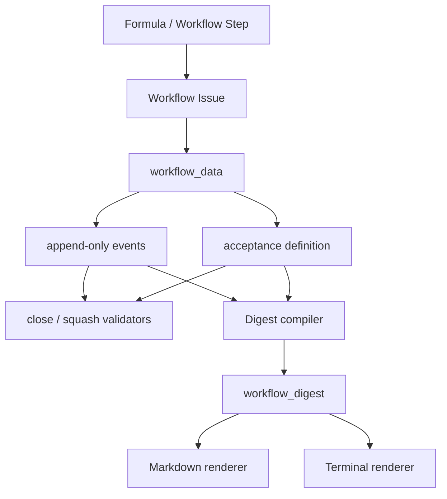
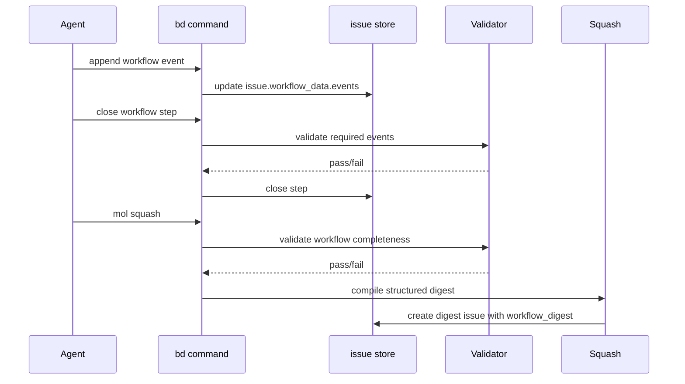

# 01 Workflow Digest

Status: Draft

## Summary

This plan introduces first-class workflow execution data to beads-lite so that
formula-driven wisps and molecules can produce rich, auditable digests instead
of shallow title lists. The design adds a structured `workflow_data` field to
issues, makes workflow execution append-only via typed journal events, validates
required event coverage before close/squash, and compiles a structured
`workflow_digest` at squash time. Human-readable markdown and terminal output
are rendered from the structured digest rather than treated as the source of
truth.

The most critical design choice is that **acceptance criteria become a
first-class artifact defined before implementation work begins**. A workflow run
cannot be considered complete unless it carries a predefined acceptance set,
records the exact commands run against that set, and preserves the validating
agent identity and session ID for each run.

## Architecture Summary





## Goals

- Preserve explicit step-by-step workflow guidance from formulas.
- Store structured per-step and per-run execution evidence on the workflow
  issues themselves.
- Produce a very detailed digest that preserves planning, review,
  implementation, signoff, wiring review, and acceptance evidence.
- Make acceptance criteria objective, predefined, command-based, and auditable.
- Fail clearly on old or incomplete workflow runs rather than degrade into
  shallow digests.

## Non-Goals

- General-purpose analytics for all issue types.
- Backward compatibility for historic workflow wisps that lack
  `workflow_data`.
- Replacing ordinary comments with structured data. Comments remain useful, but
  `workflow_data` is the canonical source for digest compilation.

## Component Design

### 1. Issue Storage Extensions

Each issue gains an optional first-class field:

```json
{
  "workflow_data": {
    "schema_version": 1,
    "run_id": "uuid-or-root-id",
    "formula_name": "run-plan-implementation",
    "step_id": "assign-coders",
    "step_kind": "implementation",
    "events": [],
    "acceptance": {},
    "digest": {}
  }
}
```

This is not a generic arbitrary metadata bag. The field is explicitly for
workflow execution and digest generation. If the project later wants a generic
metadata map, it should be a separate field.

### 2. Root Epic vs Child Task Responsibilities

#### Root Epic `workflow_data`

The root workflow issue carries run-level data:

- `run_id`
- `formula_name`
- resolved formula variables
- participating agents
- acceptance criteria definition
- convergence summaries
- final signoff summaries
- compiled `workflow_digest` after squash

#### Child Task `workflow_data`

Each child step carries task-local history:

- `step_id`
- `step_kind`
- append-only event list
- task-local findings, commits, review notes, cleanup items, test refs

This keeps provenance attached to the step that produced it and prevents the
root epic from becoming a dumping ground.

### 3. Event Model

Workflow history is append-only. Each meaningful action becomes a typed event.

#### Common Fields

Every event includes:

- `event_type`
- `timestamp`
- `agent_name`
- `session_id`
- `summary`
- `status_before`
- `status_after`

#### Planning / Review Event Types

- `plan_written`
- `plan_reviewed`
- `review_incorporated`
- `convergence_updated`
- `seam_reviewed`
- `signoff_reviewed`

Additional fields:

- `doc_refs`
- `finding_count`
- `findings_by_severity`
- `disposition_refs`
- `open_questions`
- `round`
- `review_mode`

#### Implementation Event Types

- `implementation_started`
- `implementation_commit`
- `review_received`
- `review_followup_commit`
- `followup_bead_created`
- `implementation_completed`

Additional fields:

- `commit`
- `review_ref`
- `judgement_calls`
- `challenges`
- `cleanup_later`
- `best_tests`
- `followup_bead_ids`

#### Validation / Acceptance Event Types

- `acceptance_defined`
- `acceptance_run`
- `validation_run`
- `final_signoff`

Additional fields:

- `criteria_id`
- `command`
- `expected_result`
- `actual_result`
- `artifacts`
- `signoff_statement`

### 4. Acceptance Criteria Lifecycle

This is the critical part of the design.

#### When Acceptance Criteria Are Defined

Acceptance criteria are defined **before implementation begins** and attached to
the root workflow issue, typically during the last planning/review phase before
`plan-to-beads` hands off to implementation.

For the plan-oriented workflows in this repo:

1. During `run-plan-review`, after convergence and seam review are complete,
   the workflow must either:
   - discover an existing acceptance definition artifact and attach it, or
   - create/update the acceptance definition on the root epic before
     `plan-to-beads` completes.
2. `run-plan-implementation` must refuse to proceed if the selected root epic
   lacks a valid acceptance definition.

This makes acceptance criteria part of the handoff contract from planning to
implementation, not an afterthought invented at the end.

#### Where Acceptance Criteria Live

The canonical acceptance definition lives on the root epic:

```json
"acceptance": {
  "defined_by": {
    "agent_name": "planner-agent",
    "session_id": "sess-123"
  },
  "defined_at": "timestamp",
  "criteria": [
    {
      "id": "AC1",
      "name": "Targeted close-continue behavior",
      "command": "go test ./internal/cmd -run TestCloseContinueAdvancesNextStepForEphemeralMolecule",
      "expected_result": "exit 0"
    }
  ]
}
```

The execution of those criteria is recorded as events either on the root epic
or on the dedicated validation/signoff child tasks, but always referencing the
same predefined criteria IDs.

#### Acceptance Definition Rules

- Criteria must be explicit commands.
- Expected outcome must be concrete: exit code, expected output fragment, or
  artifact existence.
- Criteria must be defined before implementation completion.
- Criteria are immutable once implementation work starts, except through an
  explicit amendment event explaining why the acceptance contract changed.

### 5. Validation Rules

#### Close Validation

When closing a workflow step, beads-lite validates that required event coverage
exists for that step kind.

Examples:

- an implementation step cannot close without at least one
  `implementation_commit` or an explicit `implementation_completed` event
- a review step cannot close without a `plan_reviewed` or `review_received`
  event
- a signoff step cannot close without a `final_signoff` or `validation_run`
  event

#### Squash Validation

`bd mol squash` validates:

- root epic has `workflow_data`
- child workflow steps have the required event coverage
- root epic has predefined acceptance criteria
- all required acceptance criteria have corresponding pass events
- final signoff and wiring review events exist where the formula requires them

If validation fails, squash errors instead of producing a low-signal digest.

### 6. Digest Compiler

`workflow_digest` is structured JSON stored on the digest issue. Markdown is a
rendered view, not the canonical form.

Proposed schema:

```json
{
  "schema_version": 1,
  "run_id": "bl-wisp-muo",
  "workflow_name": "run-plan-implementation",
  "scope": "Batch2",
  "summary": {},
  "planning_review_history": [],
  "convergence_summary": [],
  "seam_review_summary": [],
  "implementation_timeline": [],
  "review_followups": [],
  "completion_signoff": [],
  "wiring_review": [],
  "acceptance_results": [],
  "outstanding_cleanup": []
}
```

#### Required Rendered Sections

1. Workflow summary
2. Planning and review history
3. Convergence summary by round
4. Seam review summary
5. Implementation timeline with commits and reviewers
6. Follow-up work
7. Completion signoff
8. Wiring review
9. Acceptance criteria and exact command results
10. Outstanding cleanup

### 7. Rendering

#### Markdown Rendering

The digest issue description is rendered from `workflow_digest` as markdown.

#### Terminal Rendering

`bd show` and any dedicated workflow/digest command should render a concise
terminal view from the same structured digest. The terminal view can collapse
detail, but it must still be sourced from the JSON digest object.

## Connected Components

| Component | Interface |
| --------- | --------- |
| `internal/issuestorage` | Issue JSON schema gains `workflow_data` and digest payload support. |
| `internal/cmd` | `close`, `comments` or new workflow subcommands append/validate events. |
| `internal/meow/squash.go` | Compiles structured digest, validates workflow completeness. |
| Formula definitions in `.beads/formulas/` | Workflow step kinds and required evidence semantics must align with validators. |

## Package / Module Structure

- `internal/issuestorage`
  - extend issue struct with `WorkflowData`
- `internal/workflowdata`
  - schema types
  - validation helpers
  - digest compiler
  - renderers
- `internal/cmd`
  - append event commands/helpers
  - close/squash validation hooks
- `internal/meow`
  - squash integration

Import direction should remain:

`cmd -> workflowdata -> issuestorage`

`meow -> workflowdata -> issuestorage`

This keeps workflow digest logic out of raw storage and avoids burying business
rules in the CLI.

## Acceptance Criteria

These scenarios focus on the end-user CLI behavior, not internal APIs.

1. `Workflow Step Cannot Close Without Required Evidence`
   - Create a workflow wisp with a step that requires implementation evidence.
   - Attempt to close the step without the required workflow event.
   - Expected outcome: the CLI rejects the close with a clear validation error.

2. `Implementation Workflow Auto-Claims and Records Evidence`
   - Run an implementation workflow wisp.
   - Append implementation and review evidence to a child task.
   - Close the child task with `--continue`.
   - Expected outcome: the next step becomes assigned and in progress for the
     active actor, preserving workflow continuity.

3. `Squash Fails on Missing Acceptance Definition`
   - Run a workflow wisp without acceptance criteria defined on the root epic.
   - Attempt to squash it.
   - Expected outcome: squash fails with an error explaining that acceptance
     criteria are missing.

4. `Squash Produces Structured Digest`
   - Run a workflow wisp with valid workflow events and passing acceptance runs.
   - Squash it.
   - Expected outcome: the resulting digest issue contains a structured digest
     and rendered markdown sections for planning, implementation, review, and
     acceptance.

5. `Acceptance Digest Shows Exact Commands`
   - Define multiple acceptance criteria as exact commands on the root epic.
   - Run and record them through the validation/signoff steps.
   - Expected outcome: the final digest shows each criteria ID, exact command,
     expected result, actual result, validating agent, and session ID.

## Testing Strategy

- Unit tests for schema validation rules by step kind
- Unit tests for acceptance-definition immutability after implementation start
- Unit tests for digest compilation from representative workflow event graphs
- Command tests for close validation and squash validation failures
- End-to-end tests for workflow run -> evidence capture -> squash digest output

## URP

- Enforce evidence completeness before any workflow close/squash transition.
- Persist both structured digest JSON and rendered markdown.
- Validate acceptance criteria definitions for command presence, expected
  outcome presence, and run coverage.
- Add digest integrity checks that fail if rendered markdown no longer matches
  the structured digest payload.

## Extreme Optimization

- Keep renderers pure and deterministic so digest markdown can be regenerated
  cheaply instead of stored as the only source of truth.
- Precompute compact digest indexes for terminal display if workflow histories
  become large.

## Alien Artifacts

- No exotic technique is required to make the first version correct.
- If histories become large, event compaction or provenance compression could be
  added later, but that is not necessary for the initial design.
